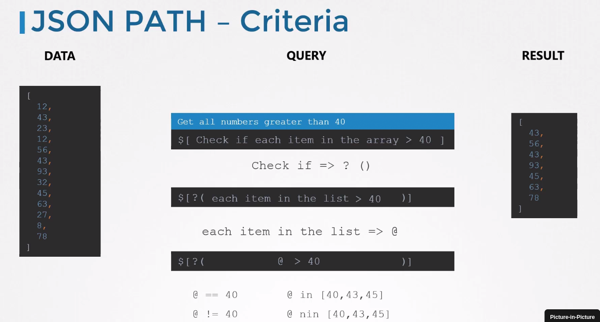
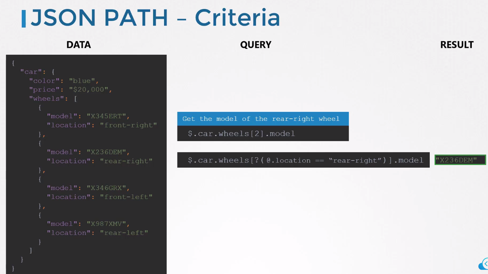
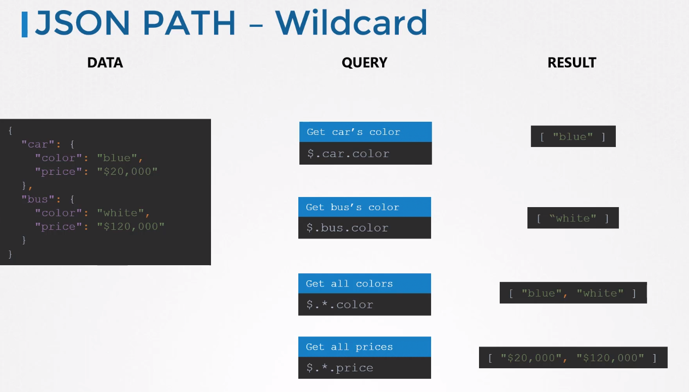
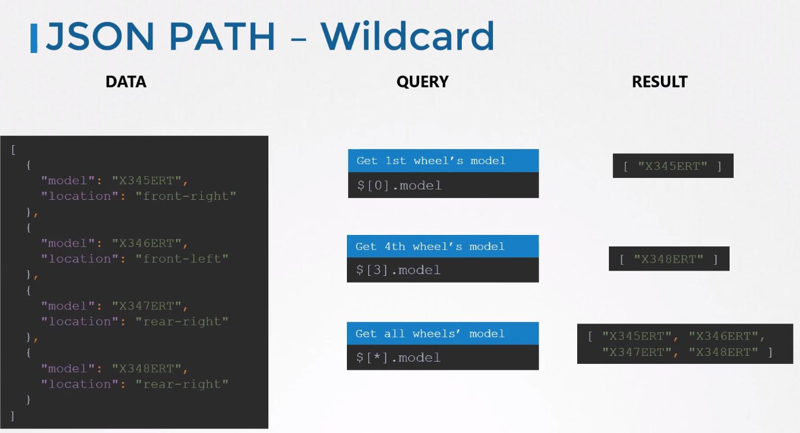
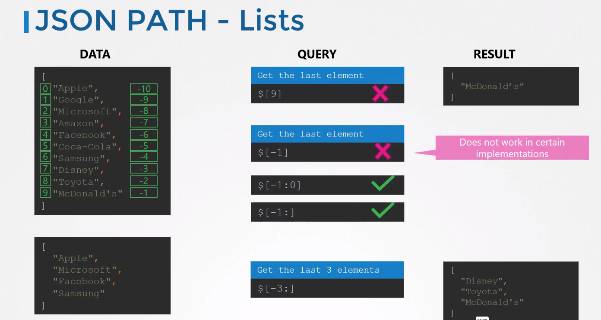
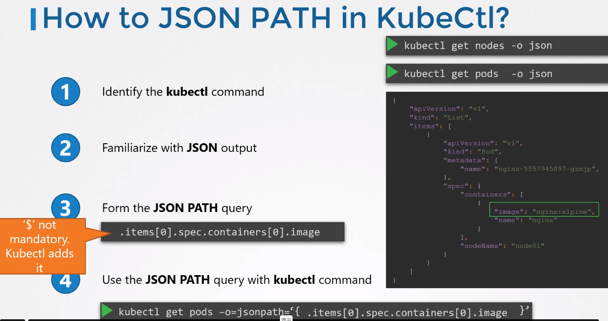
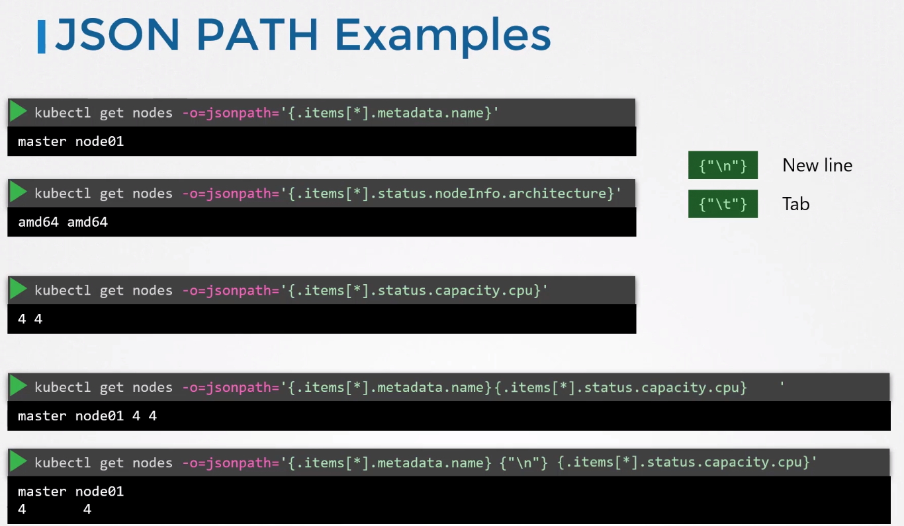
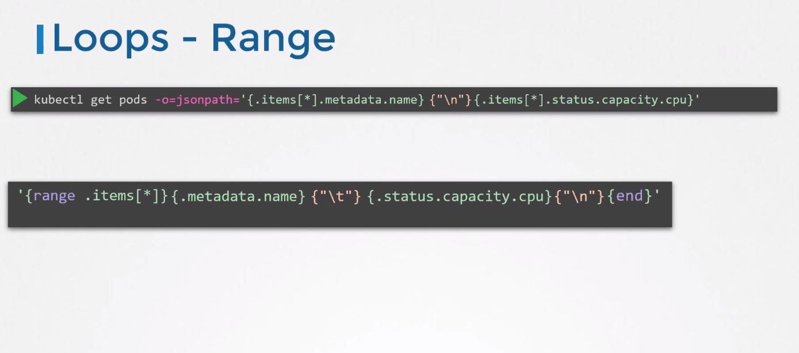
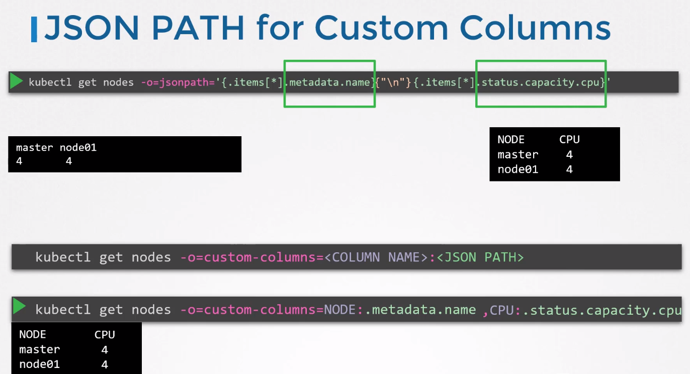
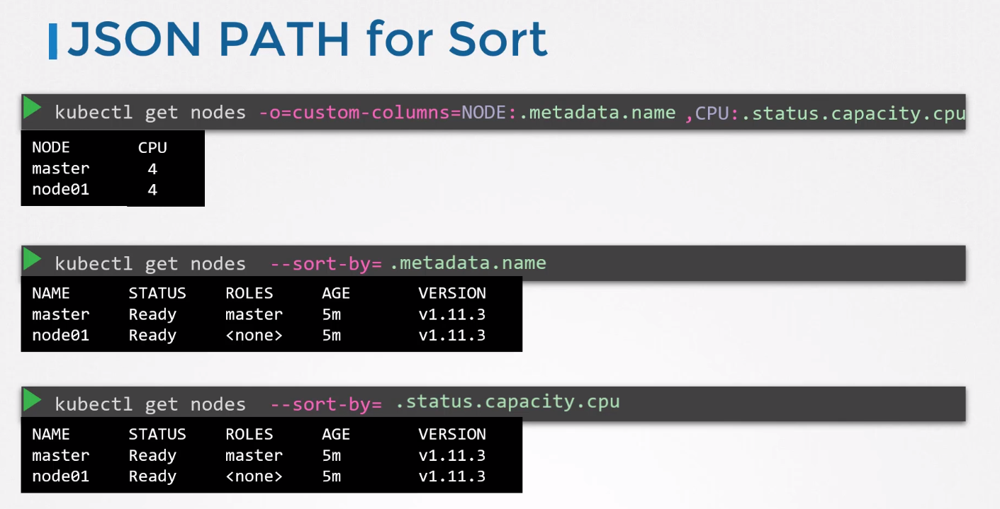

# JSON Path

root element - $  
Dictionaries - encapsulated in curly braces - in the path you separate values with dot   
Lists - encapsulated in square brackets, in path you take the value with index like [2] - 3rd element  

## Online tool
https://jsonpath.com/

## Operators



## Wildcards



## Lists

To get 1st to 4th element: ```$[0:3]```  
You can also ad stetp: ```$[0:8:2]``` - this will give even  
Last element: ```$[-1:]```



## Kubernetes





