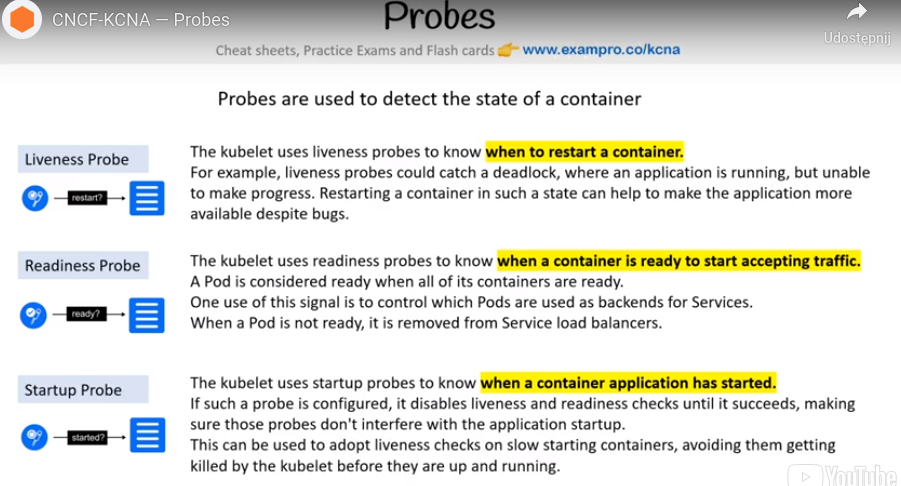
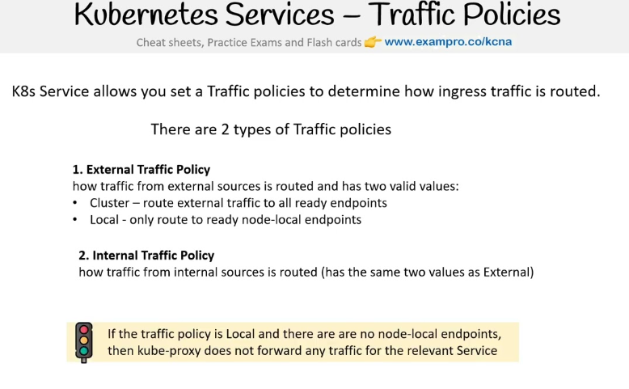
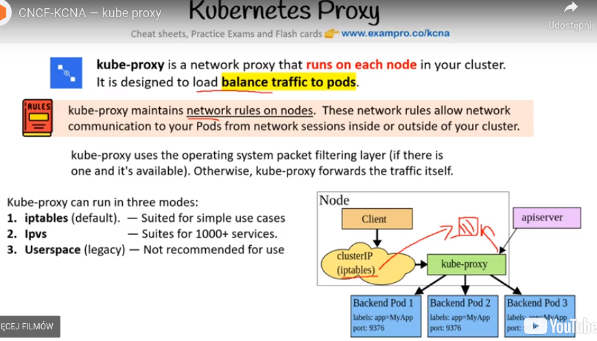
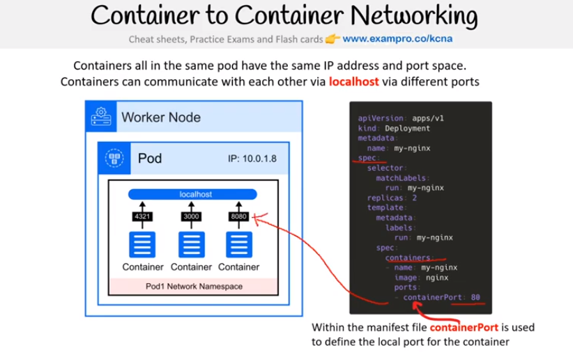
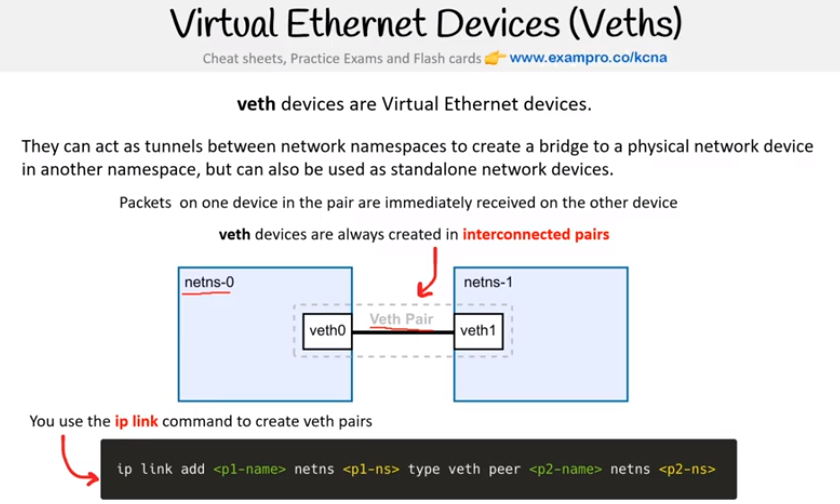
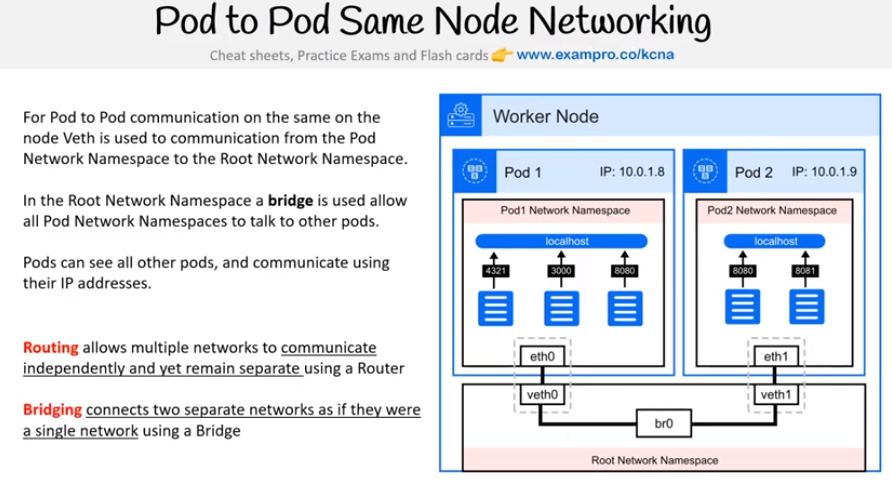
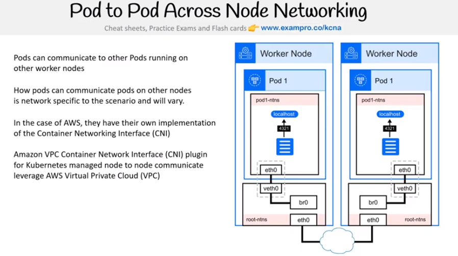
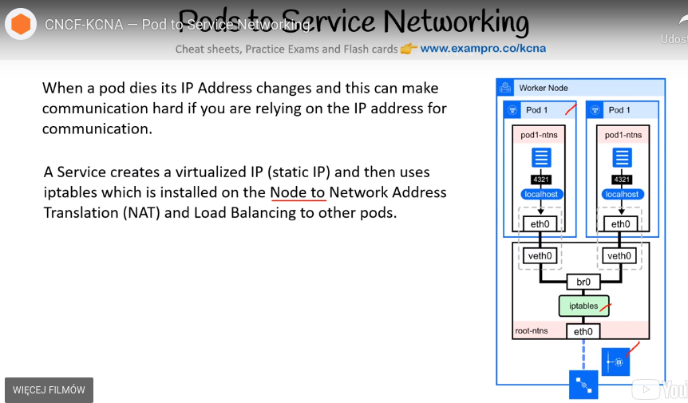

# KCNA notes

## Probes


## Traffic policies


## Kube-proxy


## Network namespaces
Adding namespace:
```bash
sudo ip netns add ns1
```

## Container-to-container networking


## Veths


## Pod-to-pod communication within same node


## Pod-to-pod communication accross nodes
_

## Pod-to-service communication

