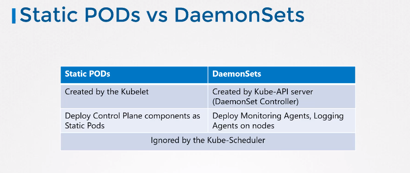

# Static PODs

Put yaml manifests in /etc/kubernetes/manifests (this is configurable) on k8s node. Kubelet will instantiate such pods. But no possibility for replicasets, daemonsets, etc.  


When you change the manifest inside /etc/kubernetes/manifests katalog the static pod will automatically recreate.

## Configuration for catalog for static PODs in kubelet
* _--pod-manifest-path_ argument during starting kubelet process.
* _--config=kubeconfig.yaml_ and inside kubeconfig.yaml: statocPodPath: /etc/kubernetes/manifests

node name is automatically appended to the podname

## To check the status of static pods
SSH to k8s node and run:
```
crictl ps
```

## Static PODs vs DaemonSets

