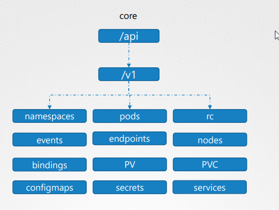
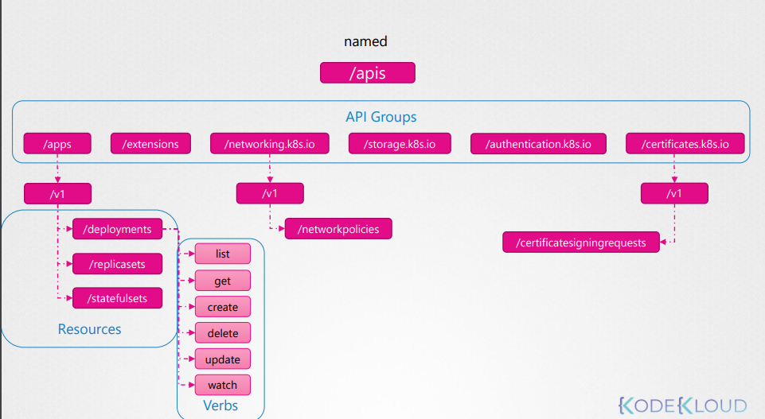

# API Groups

API Groups:
* /metrics
* /healthz
* /version
* /api - core (legacy) group - group is found at REST path /api/v1. The core group is not specified as part of the apiVersion field, for example, apiVersion: v1.
* /apis - named groups - are at REST path /apis/$GROUP_NAME/$VERSION and use apiVersion: $GROUP_NAME/$VERSION (for example, apiVersion: batch/v1)
* /logs  

We'll focus on /api and /apis  

## Kubernetes API reference

[Link](https://kubernetes.io/docs/reference/generated/kubernetes-api/v1.27/)

## Core group (/api)

## Named group (/apis)

