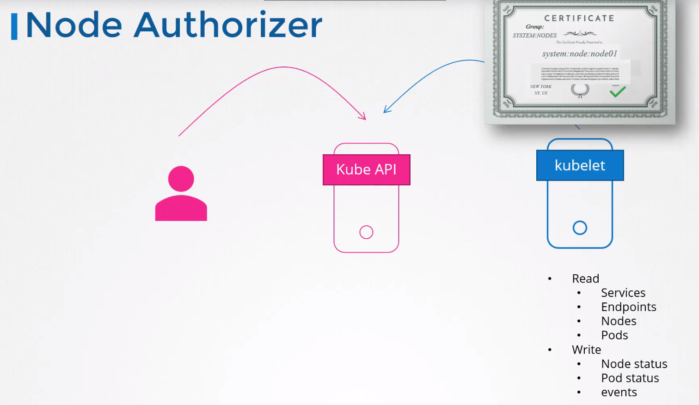

# Authorization

AuthZ mechanisms:
* Node
* ABAC
* RBAC 
* Webhook
* AlwaysAllow
* AlwaysDeny

Mechanism is set in the _--authorization-mode_ argument of kube-apiserver. This argument can have multiple values e.g. _--authorization-mode=Node,RBAC,Webhook_. In this case authorization is done sequentially.

## Node authz
Internal access for nodes. Node authorizer.
All nodes are part of SYSTEM:NODES group.

## ABAC

External access for users. Difficult to manage.

## RBAC

Role Based Access Control.

## Webhook

E.g. OPA.