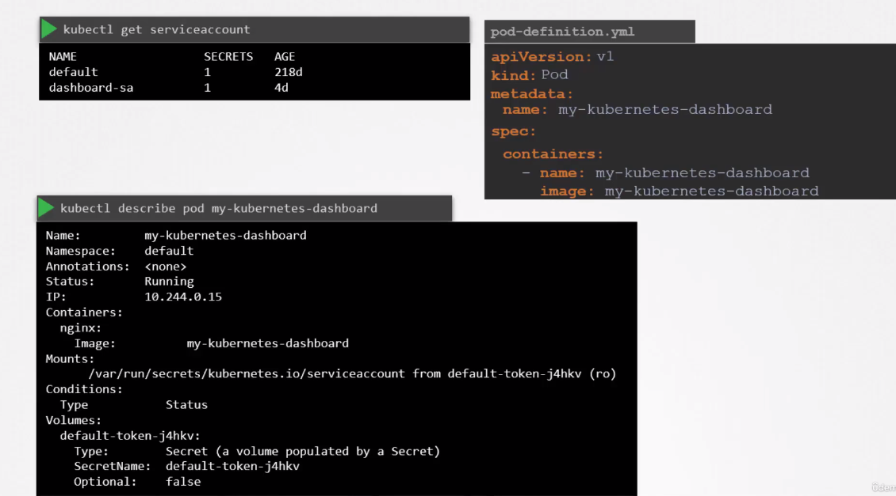
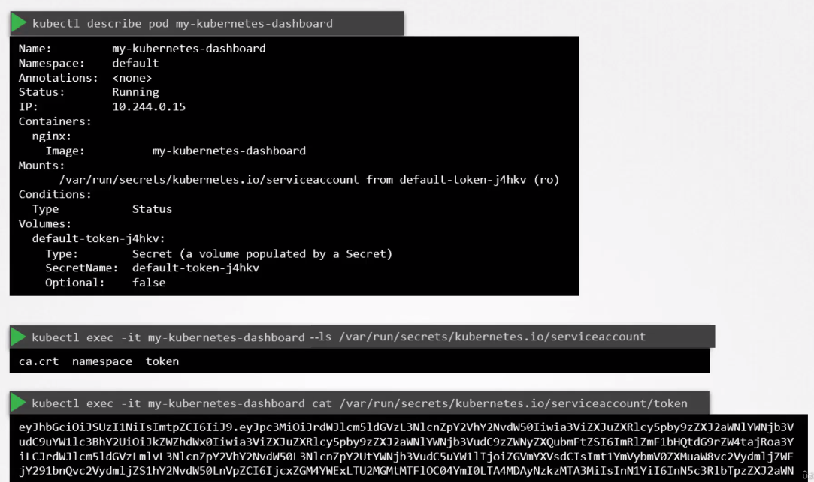
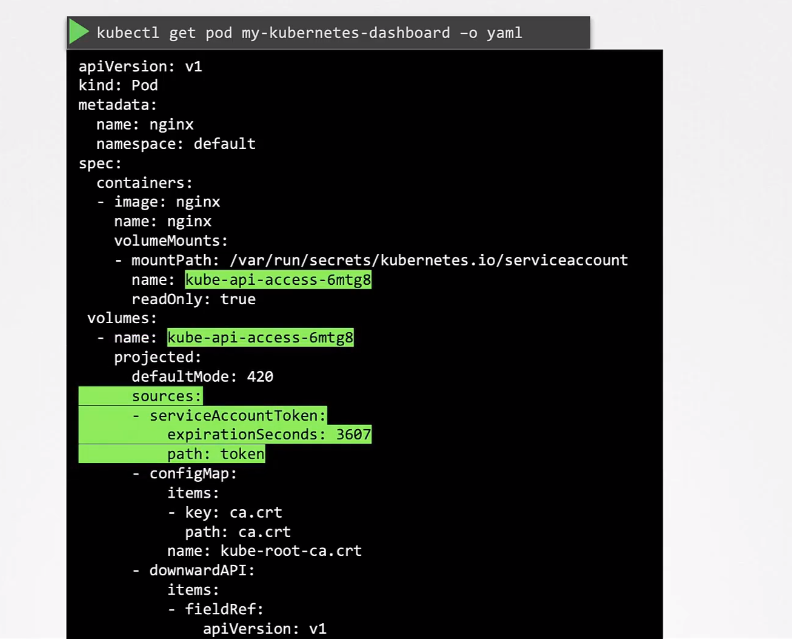

# Service accounts

## Creating
```
kubectl create serviceaccount dashboard-sa
```
Creating SA ionvolves creating token automatically stored as a secret object. This token can be used with curl with Authorization Bearer like:  
``` curl https://master-node:6443/api --insecure --header "Authorization: Bearer aksdakdsAdsdlskd..."```

## Default SA
Each namespace has default SA.
Whenever a pod is created, the default SA and its token are automatically mounted to that pod as a volume mount. This token is for accessing k8s api.

> This default behavior can be turned off with _automountServiceAccountToken: false_ in Pod spec.




## Using different SA in the pod

```yaml
apiVersion: v1
kind: Pod
metadata:
  name: pod-name
  labels:
    app: myapp
spec:
  containers:
  - name: nginx-server
    image: nginx
  serviceAccountName: dashboard-sa
```

## Decoding a token

It's JWT token.  
To decode from CLI:
 ``` 
 jq -R 'split(".") | .[0],.[1] | @base64d | fromjson' <<< $(cat "${JWT}") 
 ```

 To decode in GUI: [jwt.io](https://jwt.io)

 ## Updates in k8s 1.22 & 1.24

### With 1.22
Adds expiry date to the token.  
Introducing TokenRequestAPI. Tokens generated by this API are:
* Audience Bound
* Time Bound
* Object Bound
No longer mounted as volume with files. Instead there is projected volume that communicates with TokenRequestAPI:


### With 1.24  
Token is no longer generated automatically with SA. You need to do:

```
kubectl create serviceaccount dashboard-sa
kubectl create token dashboard-sa
```
Second comand obtains token from the TokenRequest API.
This generated token has expiry date (1h by default).