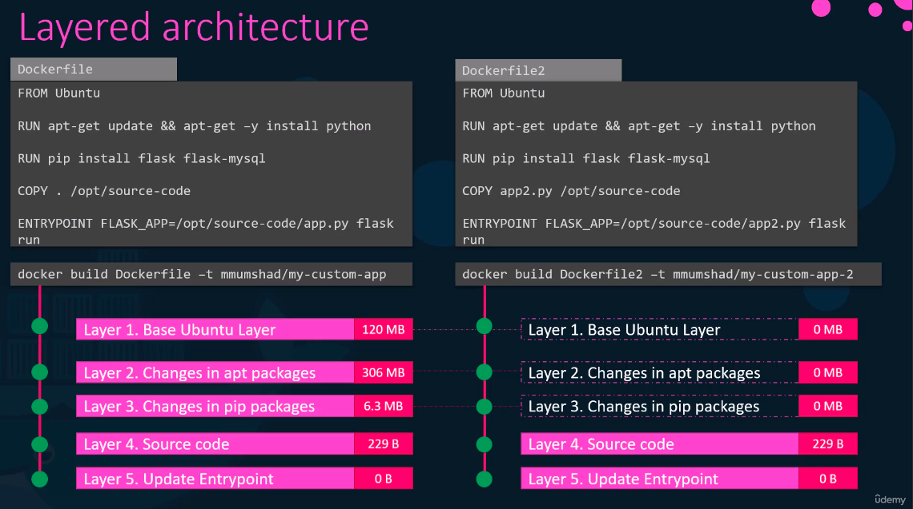
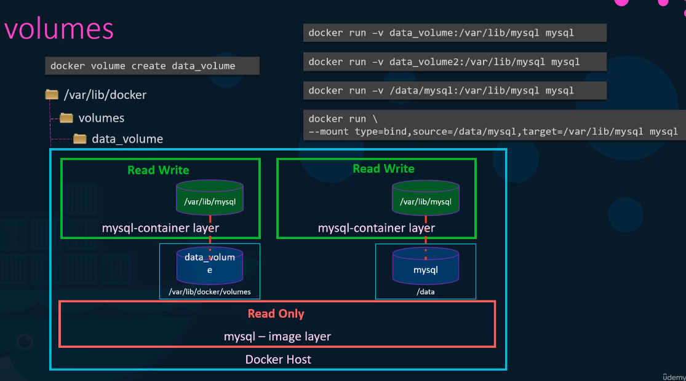
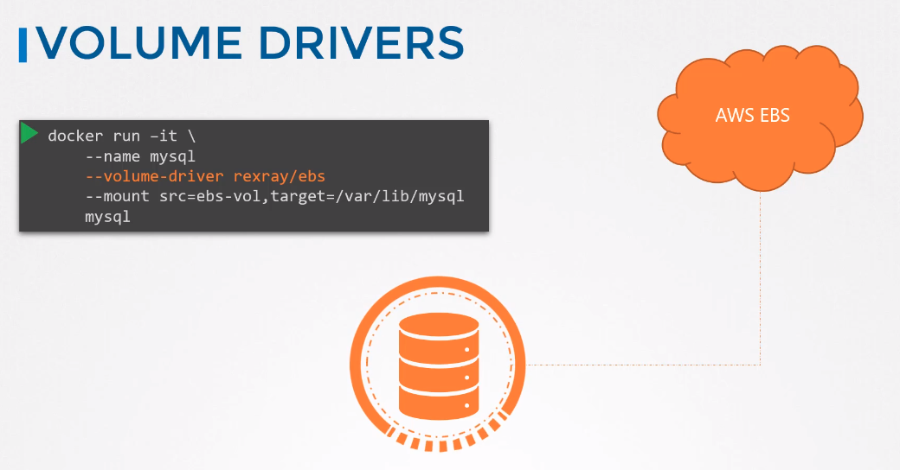

# Docker storage

## Layered architecture

Content is cached so next build is faster.  

## Copy-on-write
Copy-on-write mechanism - happens when overwriting file from read-only layers - docker automatically copies this file from read-only layer to read-write layer. All future modifications will happen on this read-write layer.

## Docker volumes

When you put in -v non-existing volume docker will automatically create it, so no need to do ```docker volume create```.  
Two types of mounts:
* bind mount - of existing catalog - like /data/mysql on the slide
* volume mount - volumes inside /var/lib/docker/volumes
> -v is obsolete, use --mount


## Storage drivers

Available are:
* AUFS
* ZFS
* BRTFS
* Device Mapper
* Overlay
* Overlay2

Storage drivers are responsible for maintaining layered architecture, creating writable layers, copying files between layers (_copy_on_write_), etc.


## Volume drivers

Volumes are not handled by storage drivers. They are handled by volume driver plugins. Available plugins:
* Local - volumes on the local docker host
* GCE-docker
* GlusterFS
* NetApp
* Portworx
* VMWare vSphere Storage
* Convoy
* Azure File Storage
* RexRay - which can leverage AWS S3
* etc.

