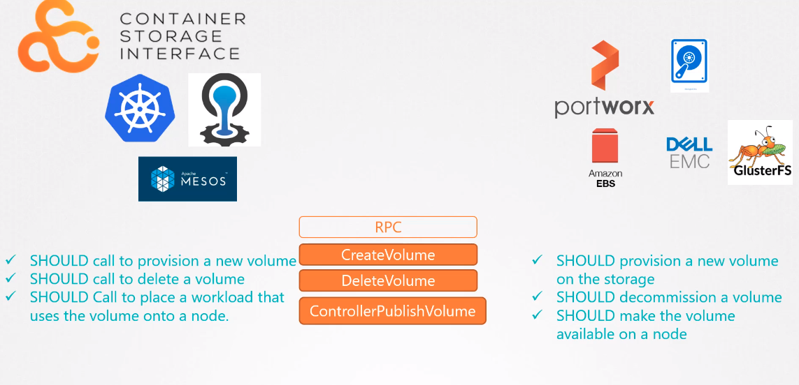

# CSI

Universal standard, not tied to K8s. Currently CloudFoundry, Mesos & Kubernetes support CSI.

CSI define set of RPCs that will be called by Container Orchestrator and these must be implemented by the storage drivers.  

For example, CSI says that when a pod is created and requires a volume, the container orchestrator, in this case Kubernetes, should call the create volume RPC and pass a set of details such as the volume name.  The storage driver should implement this RPC and handle that request and provision a new on the storage array, and return the results of the operation.  Similarly, container orchestrator should call the delete volume RPC when a volume is to be deleted, and the storage driver should implement the code to decommission the volume from the array when that call is made.  And the specification details exactly what parameters should be sent by the color, what should be received by the solution, and what error codes should be exchanged.