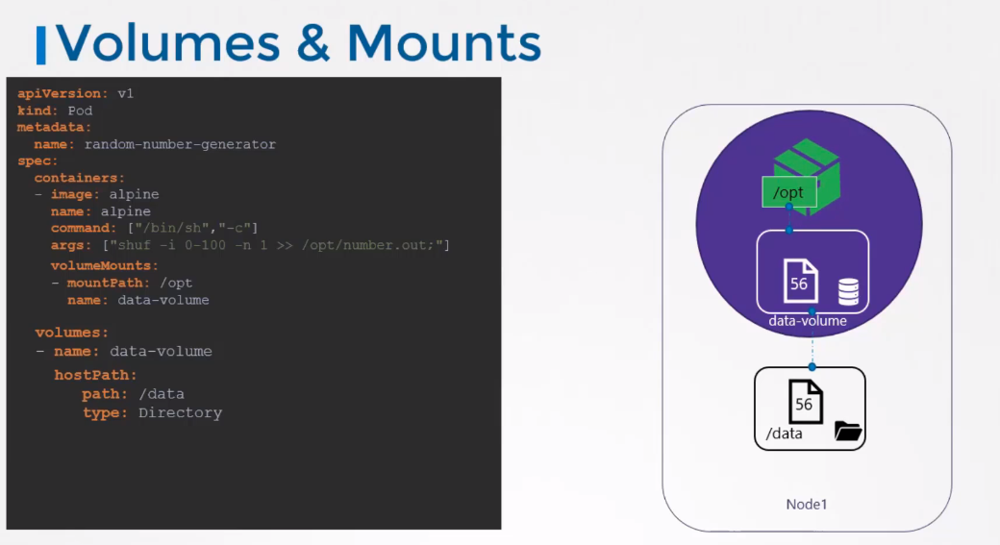
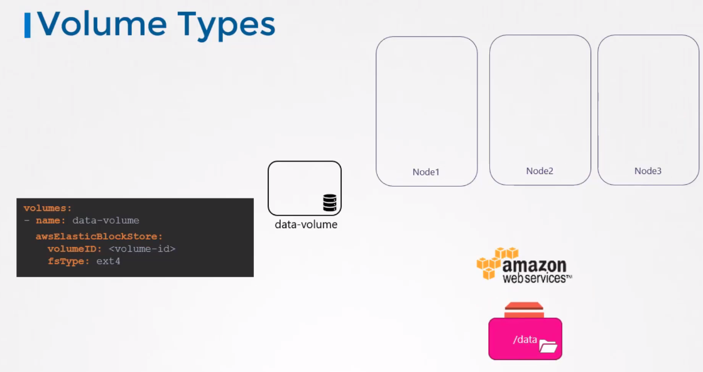

# Volumes

hostPath works fine on a single node. But is not recommended in the multi-node clusters. Because if pods run on multiple nodes they expect /data to be the same on each node.

## Volume types
Other than hostPath:
* NFS
* GlusterFS
* Flocker
* CEPH
* ScaleIO
* Google Persistent Disk
* EBS

