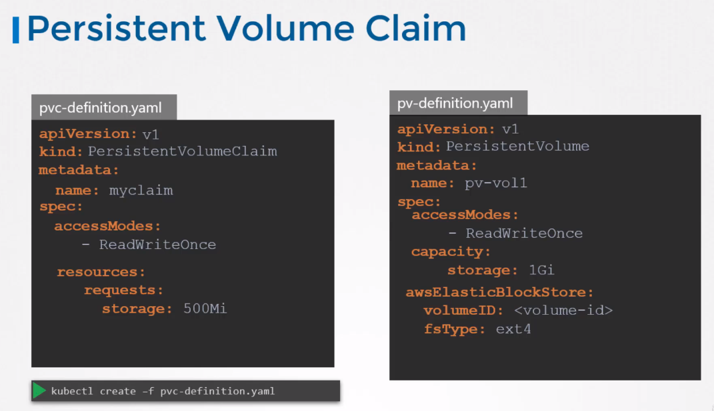

# Persistent Volume Claims

Administrator creates set of PVs. Users create PVCs to use the storage.  
K8s binds PVs to PVCs based on the request and properties.  
Every PVC is bound to single PV.

Poperties:
* Sufficient Capacity
* Access Modes
* Volume Modes
* Storage Class

If there are multiple possible matches (PVs) for a single claim you can use selectors to bind to specific volumes.

> Smaller claim make it bound to a larger volume if all other criteria matches and there are no better options

## Deleting PVCs

What happens when you delete PVC? It depends on _persistentVolumeReclaimPolicy_ which can be:
* Retain - PV will remain until it's manually deleted, it will not be able to be re-used by other PVCs
* Delete
* Recycle - In this case, the data in the data volume will be scrubbed before making it available to other claims.