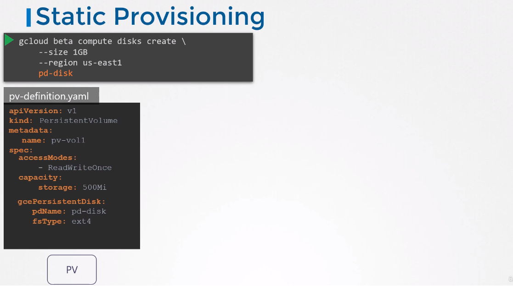
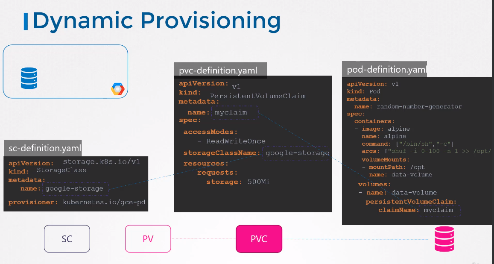
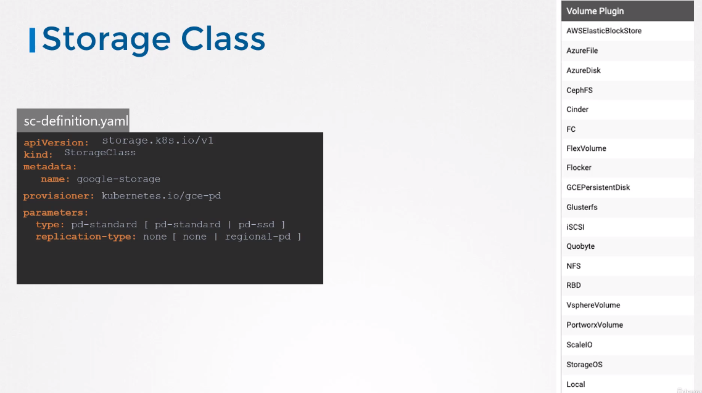
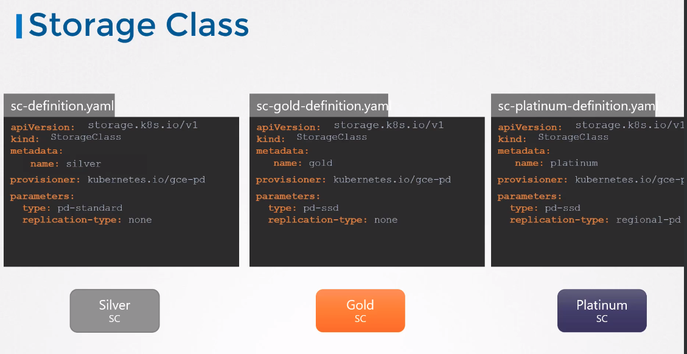

# Storage Classes

## Static provisioning

Every time you have to create a disk in the cloud provider. Would be nice to have this automated. That's why Storage Classes & Dynamic provisioning.

## Dynamic provisioning

You don't have to create PV manually anymore!

## Storage classes

