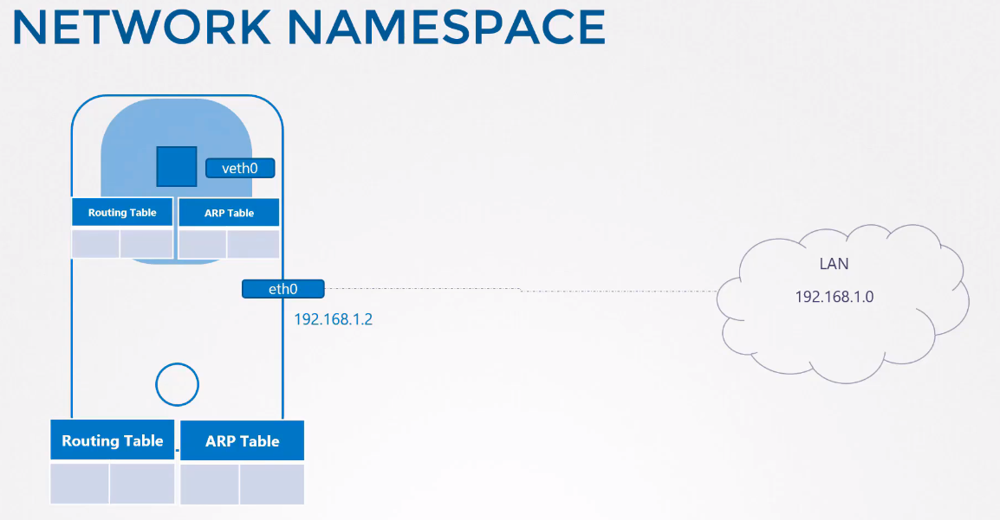
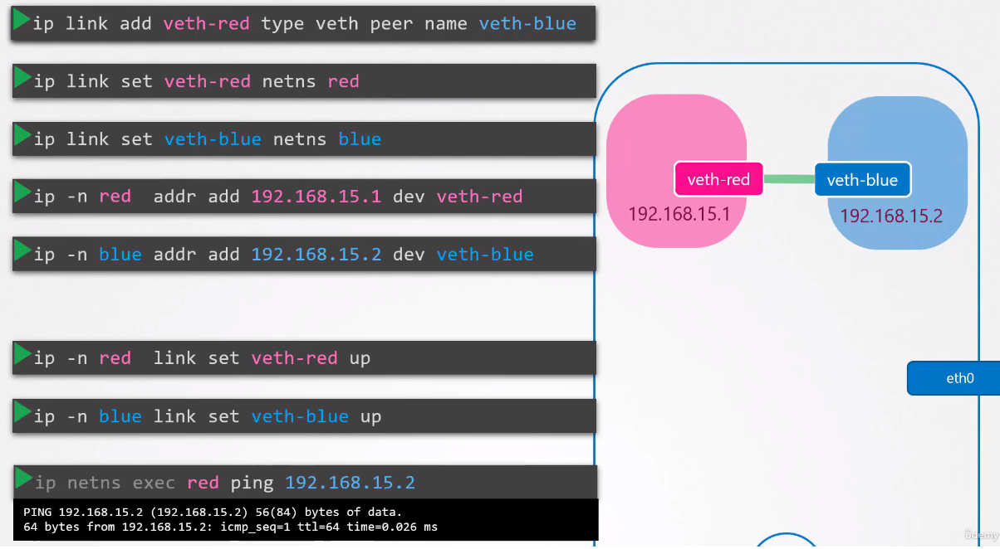
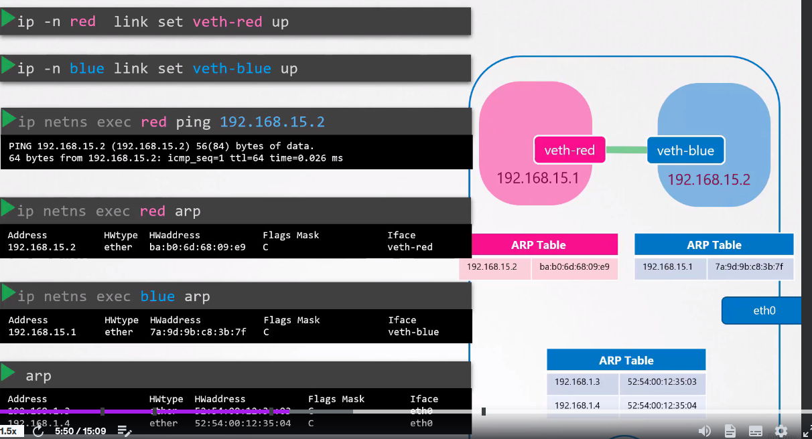
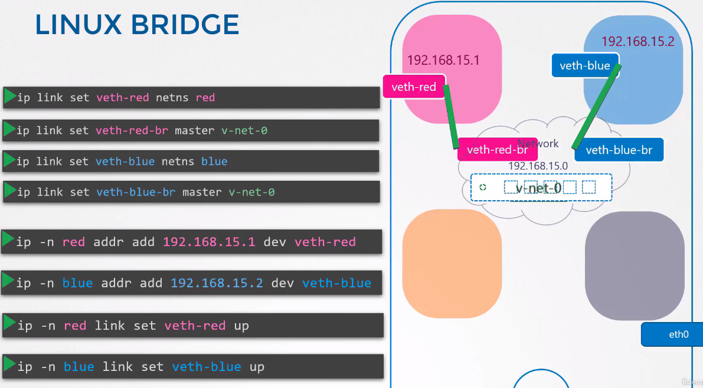

# Network namespaces



Creating namespace:
```
ip netns add new_namespace
```
Listing:
```
ip netns
```

Exec within namespace:
```
ip netns exec new_namespace ip link
ip -n new_namespace ip link
ip netns exec new_namespace arp
ip netns exec new_namespace route
```

## Veth pairs




## Communication between multiple namespaces

Creating virtual networks for namespace to communicate.

Two most common solutions:
* OvS - Open vSwitch
* Linux bridges




## FAQ 
While testing the Network Namespaces, if you come across issues where you can't ping one namespace from the other, make sure you set the NETMASK while setting IP Address. ie: 192.168.1.10/24


```ip -n red addr add 192.168.1.10/24 dev veth-red```


Another thing to check is FirewallD/IP Table rules. Either add rules to IP Tables to allow traffic from one namespace to another. Or disable IP Tables all together (Only in a learning environment).