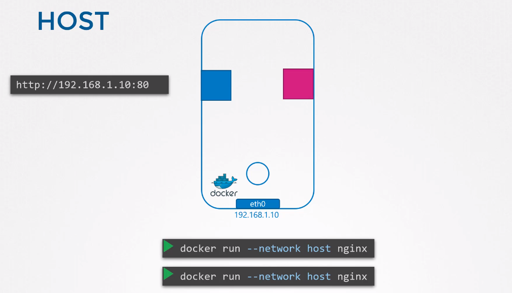
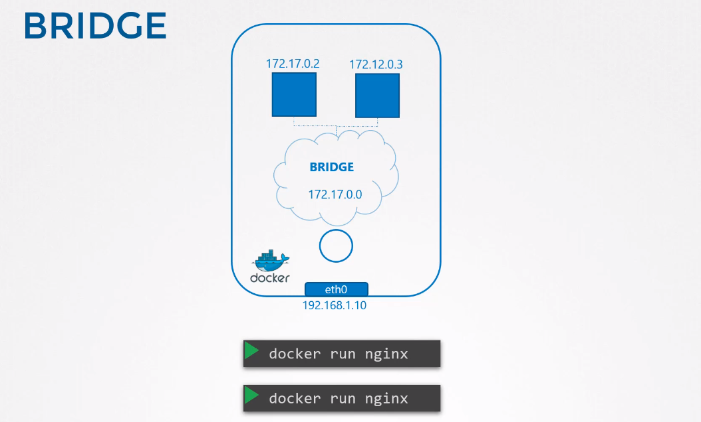
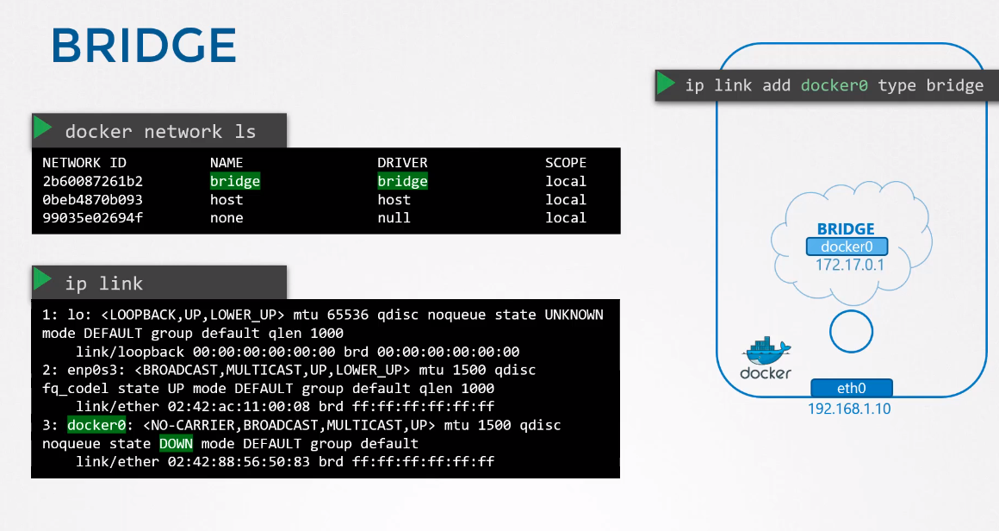
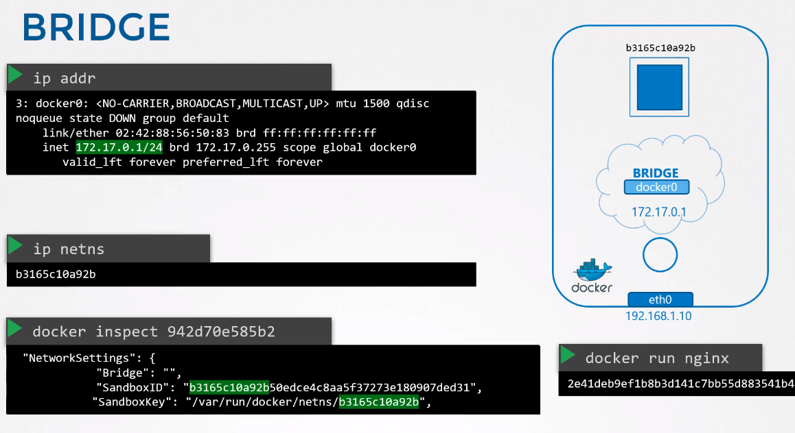
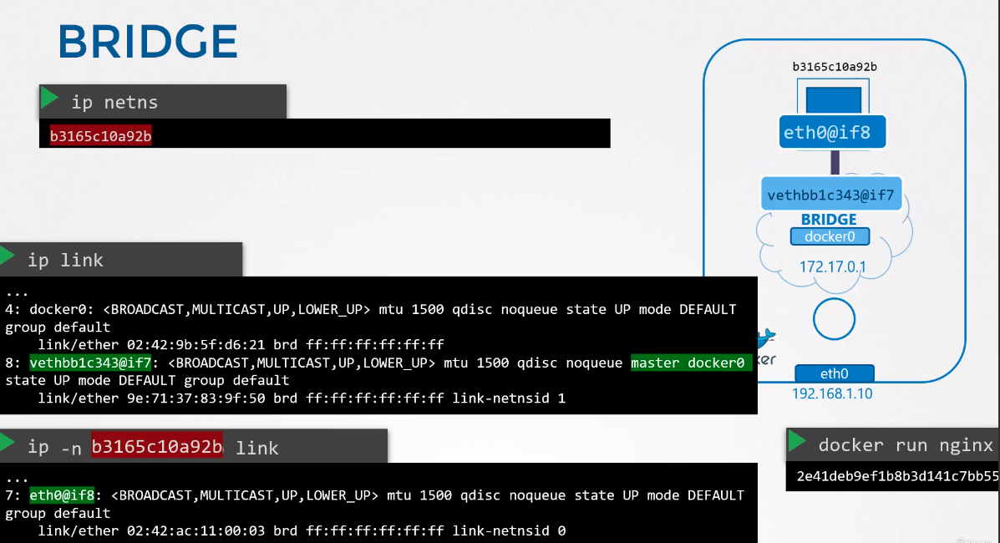
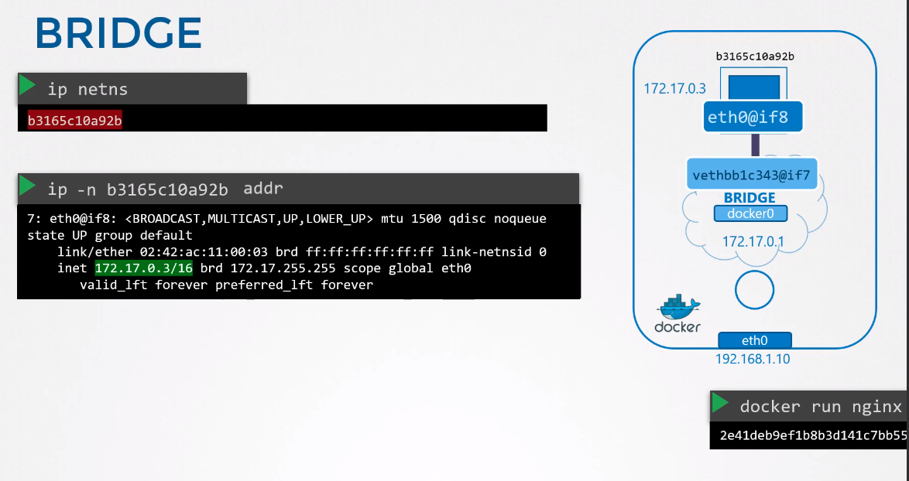
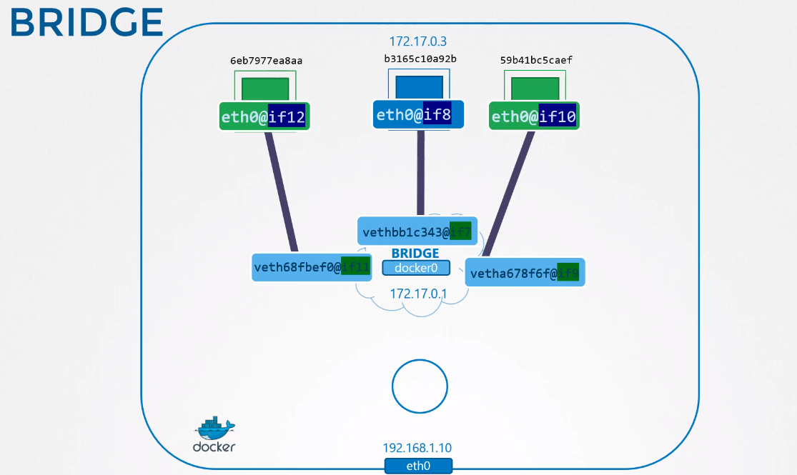
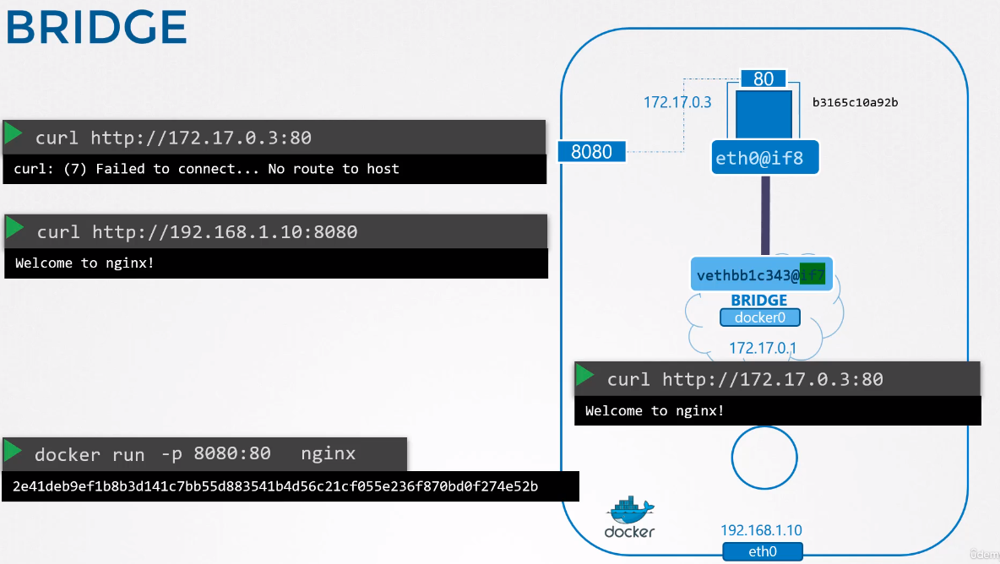

# Docker networking

Types:
* None
* Host
* Bridge

## None

```docker run --network none nginx```  
Docker container is not attached to any network.
Containers with none network cannot comunicate with each other and talk to the outside world.

## Host

Container is attached to the host network.



Instantiating second nginx container will make it unreachable as the containers share host's network and cannot both listen on 80 port.

## Bridge
Most commonly used.  
Internal private network.




Whenever container is created new network namespace is created for it.



### Attaching containers to bridge

How docker attaches container (so it's namespace) to its bridge?





### Port mapping



Internally it's done by iptables (prerouting chain).