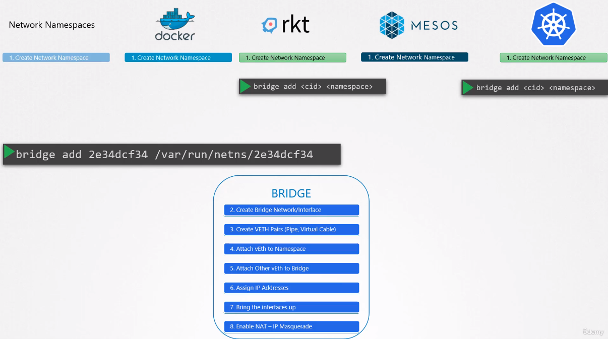
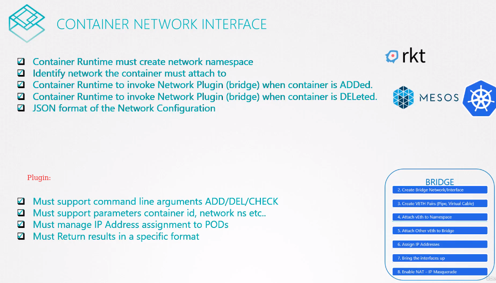

# CNI

Network Namespaces, docker, rkt, mesos, k8s all do the same things like those points 1-8 so CNI defines common standard - e.g. "bridge" program that does in every implementation the same thing. Such programs are called "plugins".

Any runtime should be able to run any plugin.

## CNI Plugins

Available plugins:
* BRIDGE
* VLAN
* IPVLAN
* MACVLAN
* WINDOWS
* DHCP - built-in plugin
* host-local - built-in plugin
* Weave
* Flannel
* Cilium
* VMWare NSX
* Calico
* Infoblox

All those plugins implement CNI Standards.

Docker is another story. It's not CNI compliant.