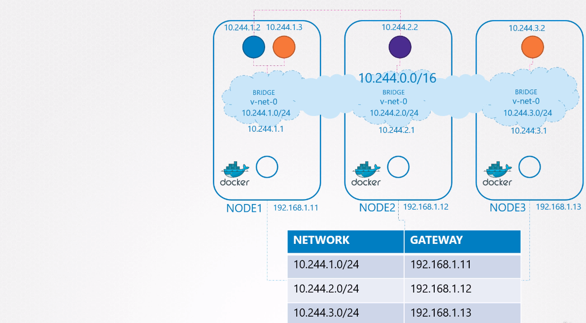

# Pod networking

## Implementation

net-script.sh has to be run for every container.  So how do we run the script automatically when a Pod is created on Kubernetes? That's where CNI comes in, acting as the middleman.  CNI tells Kubernetes that this is how you should call a script as soon as you create a container. And CNI tells us this is how your script should look like.  

CNI version:

Better solution that configuring routes on every node would be to use router:
