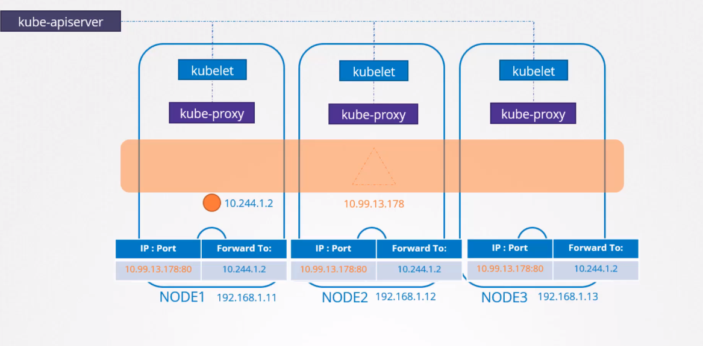
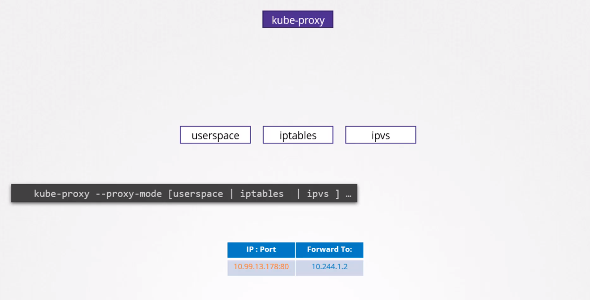
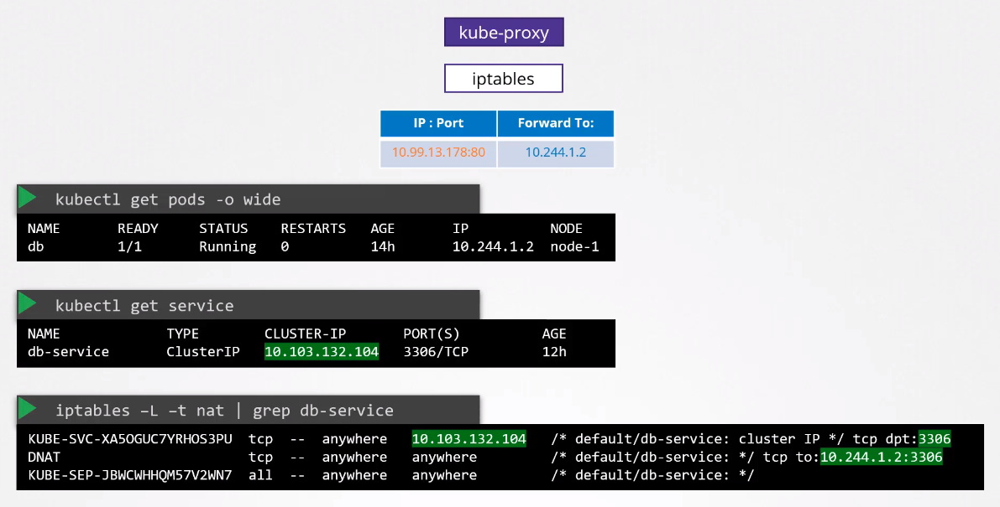
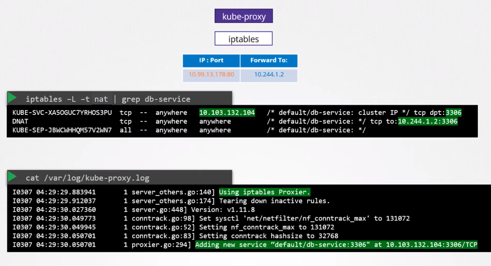

# Services

NodePort can only allocate ports higher than 30000.

Default mode of kube-proxy is iptables.

IP range of services is defined in kube-api-server in _--service-cluster-ip-range_

## Iptables in kube-proxy
ClusterIP:

NodePort:

