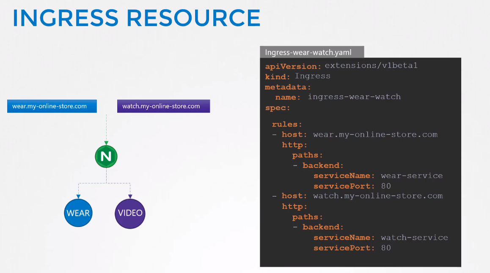

# Ingress

If on-prem then proxy-server can be used that points to NodePort service:


GCP LB & Nginx are maintained by k8s project.

## Nginx ingress controller


## Ingress objects
1 path & 2 paths:


### Split by domain



### Update in newer k8s


Now, in k8s version 1.20+ we can create an Ingress resource from the imperative way like this:-

```
kubectl create ingress <ingress-name> --rule="host/path=service:port"
```

Example - ```kubectl create ingress ingress-test --rule="wear.my-online-store.com/wear*=wear-service:80"```

Find more information and examples in the below reference [link](https://kubernetes.io/docs/reference/generated/kubectl/kubectl-commands#-em-ingress-em-)

## Default backend


You need to deploy this service: default-http-backend:80 by yourself!!!

## Ingress - annotations and rewrite-target


Different ingress controllers have different options that can be used to customise the way it works. NGINX Ingress controller has many options that can be seen [here](https://kubernetes.github.io/ingress-nginx/examples/). I would like to explain one such option that we will use in our labs. The [Rewrite](https://kubernetes.github.io/ingress-nginx/examples/rewrite/) target option.


Our watch app displays the video streaming webpage at http://<watch-service>:<port>/

Our wear app displays the apparel webpage at http://<wear-service>:<port>/

We must configure Ingress to achieve the below. When user visits the URL on the left, his request should be forwarded internally to the URL on the right. Note that the /watch and /wear URL path are what we configure on the ingress controller so we can forwarded users to the appropriate application in the backend. The applications don't have this URL/Path configured on them:

```http://<ingress-service>:<ingress-port>/watch --> http://<watch-service>:<port>/```

```http://<ingress-service>:<ingress-port>/wear --> http://<wear-service>:<port>/```


Without the rewrite-target option, this is what would happen:

```http://<ingress-service>:<ingress-port>/watch --> http://<watch-service>:<port>/watch```

```http://<ingress-service>:<ingress-port>/wear --> http://<wear-service>:<port>/wear```


Notice watch and wear at the end of the target URLs. The target applications are not configured with /watch or /wear paths. They are different applications built specifically for their purpose, so they don't expect /watch or /wear in the URLs. And as such the requests would fail and throw a 404 not found error.


To fix that we want to "ReWrite" the URL when the request is passed on to the watch or wear applications. We don't want to pass in the same path that user typed in. So we specify the rewrite-target option. This rewrites the URL by replacing whatever is under rules->http->paths->path which happens to be /pay in this case with the value in rewrite-target. This works just like a search and replace function.

For example: ```replace(path, rewrite-target)```
In our case: ```replace("/path","/")```


```yaml
apiVersion: extensions/v1beta1
kind: Ingress
metadata:
  name: test-ingress
  namespace: critical-space
  annotations:
    nginx.ingress.kubernetes.io/rewrite-target: /
spec:
  rules:
  - http:
      paths:
      - path: /pay
        backend:
          serviceName: pay-service
          servicePort: 8282
```

In another example given here, this could also be:

```replace("/something(/|$)(.*)", "/$2")```

```yaml
apiVersion: extensions/v1beta1
kind: Ingress
metadata:
  annotations:
    nginx.ingress.kubernetes.io/rewrite-target: /$2
  name: rewrite
  namespace: default
spec:
  rules:
  - host: rewrite.bar.com
    http:
      paths:
      - backend:
          serviceName: http-svc
          servicePort: 80
        path: /something(/|$)(.*)
```
