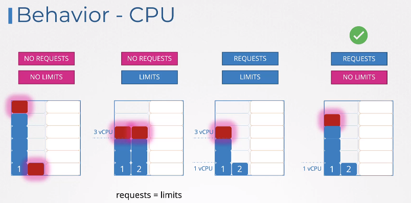
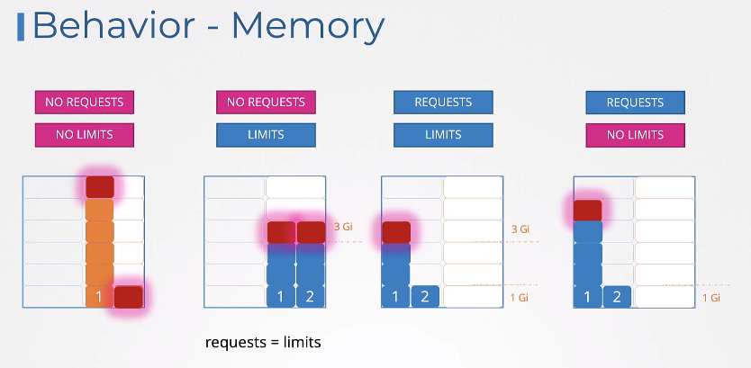

# Resources

```yaml
apiVersion: v1
kind: Pod
metadata:
  name: pod-name
  labels:
    app: myapp
spec:
  containers:
  - name: nginx-server
    image: nginx
    ports:
      - containerPort: 8080
    resources:
      requests:
        memory: "1Gi"
        cpu: 1
      limits:
        memory: "2Gi"
        cpu: 2
```

Lowest value for CPU - 1m
1 CPU = 1 vCPU

Memory can be in Mi, M, Gi, G or just number  
1 Ki (Kibibyte) = 1024 bytes  
1 K (Kilobyte) = 1000 bytes  


## Exceed limits
If POD exceeds cpu k8s will throttle it.  
If POD exceeds memory it will terminate and give OOM error

## Behavior - CPU


## Behavior - Memory


## Default resources values - LimitRange!

On the namespace level.  
LimitRange affects only newly created PODs.


### For CPU

```yaml
apiVersion: v1
kind: LimitRange
metadata:
  name: cpu-resource-constraint
spec:
  limits:
  - default:
      cpu: 500m
    defaultRequest:
      cpu: 500m
    max:
      cpu: "1"
    min:
      cpu: "100m"
    type: Container
```
max & default refers to limit  
defaultRequest & min refers to request.

### For Memory

```yaml
apiVersion: v1
kind: LimitRange
metadata:
  name: memory-resource-constraint
spec:
  limits:
  - default:
      memory: 1Gi
    defaultRequest:
      memory: 1Gi
    max:
      memory: 1Gi
    min:
      memory: 500Mi
    type: Container
```
max & default refers to limit  
defaultRequest & min refers to request.

To restrict total max resources per namespace you can use ResourceQuotas. Look [here](./06_namespaces_quotas.md)