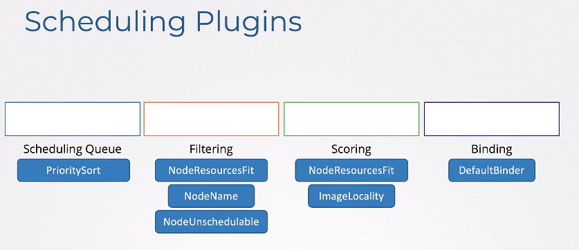
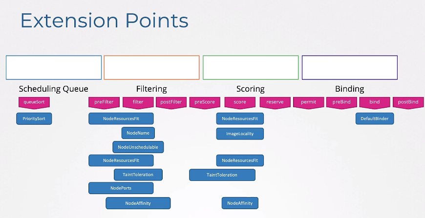
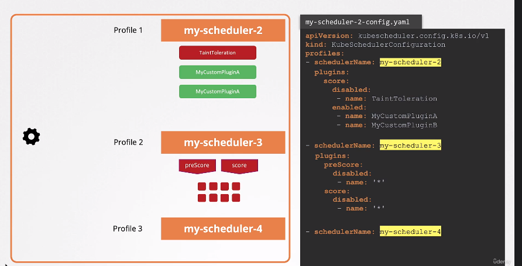

# Scheduler profiles

Pods with higher priority gets to the beginning of the SchedulingQueue. To set higher priority you must define _priorityClassName_:

```yaml
apiVersion: v1
kind: Pod
metadata:
  name: pod-name
  labels:
    app: myapp
spec:
  priorityClassName: high-priority
  containers:
  - name: nginx-server
    image: nginx
    resources:
      requests:
        memory: "1 Gi"
        cpu: 10
```

```yaml
apiVersion: scheduling.k8s.io/v1
kind: PriorityClass
metadata:
  name: high-priority
value: 1000000
globalDefault: false
description: "This priority class should be used for XYZ service pods only."
```

## Phases
1. **SchedulingQueue**
2. **Filtering** - nodes that cannot run the pod (e.g. lack of resources) are filtered out
3. **Scoring** - nodes are scored with different weights - e.g. node that has more space gets higher score
4. **Binding** - final binding pod to node

## Scheduling Plugins


## Extension Points


## Configuring scheduler profiles
